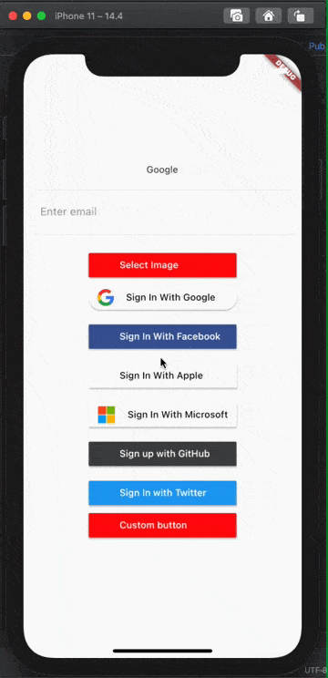

# [li_info](https://pub.dev/packages/li_info) Getting Started

This project is a starting point for a Flutter
[plug-in package](https://flutter.dev/developing-packages/),
a specialized package that includes platform-specific implementation code for
Android and/or iOS.

For help getting started with Flutter, view our
[online documentation](https://flutter.dev/docs), which offers tutorials,
samples, guidance on mobile development, and a full API reference.

## Plugin android and ios
 
&nbsp;&nbsp;&nbsp;

also most welcome for contributors [Contact Us](mailto:kishor@logisticinfotech.com) 

